# EscapeRoomVR
**Game Story**
You are a treasure hunter who has stumbled upon an ancient ruin. You enter a dimly lit room and find a door in the center, with three locks. Each lock presents a puzzle that you must solve to escape the room and find the lost treasure. You have only three minutes to complete the puzzles or you will be trapped forever.

Puzzle 1: Numerical Pad Lock The first lock is a numerical pad with numbers 0-9. You must solve a tricky math equation to find the code to unlock the door.

Puzzle 2: Piece Matching Box Lock The second lock is a box with slots for matching pieces that you must collect throughout the room. The pieces fit together to form a shape or image that will unlock the door.

Puzzle 3: Treasure Insertion Lock The third lock is a slot for the treasure item that you must find in order to unlock the door and escape the room. The treasure item is hidden somewhere in the room, and finding it will require careful searching and observation.

As you explore the room, you will encounter props and objects that hint at the lost treasure and the history of the ancient ruin. The environment is designed to be immersive, with cobwebs, cracks in the walls, and a musty smell to give you a sense of being in a forgotten place.

Can you solve the puzzles and find the lost treasure before time runs out? Test your skills and see if you can beat the high score.

**Optimization**
1. To optimize the performance and graphics quality of the game, several steps were taken. The first step was to utilize Unity's Universal Render Pipeline (URP) and the Samples Pipeline Asset. The URP provides a prebuilt solution for high-quality graphics and performance, and the Samples Pipeline Asset provides a set of customizable options for controlling the pipeline's behavior.
     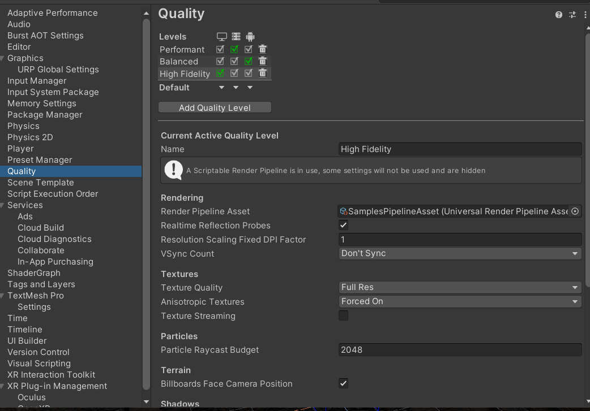
 
2. In the Samples Pipeline Asset's quality section, the HDR option was unchecked to reduce the computational load and improve performance. The anti-aliasing option was set to 4x to improve the image quality and reduce visual artifacts.
     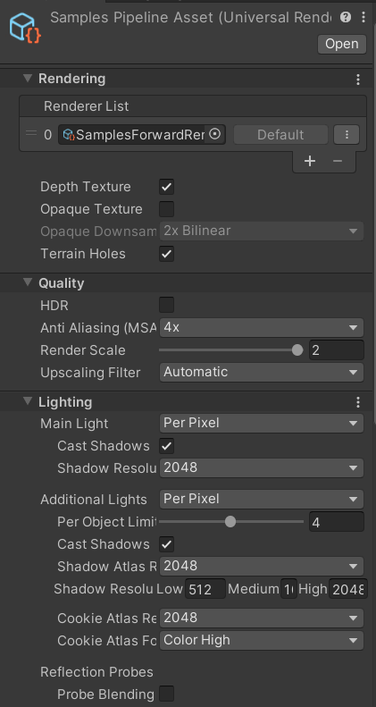
 
3. In the player's other settings, the graphics APIs were set to Vulkan and the auto graphics API option was unchecked. By doing this, the Vulkan API was selected specifically to maximize performance. The texture compression format was set to ASTC to reduce the texture size and improve performance on the target platform.
     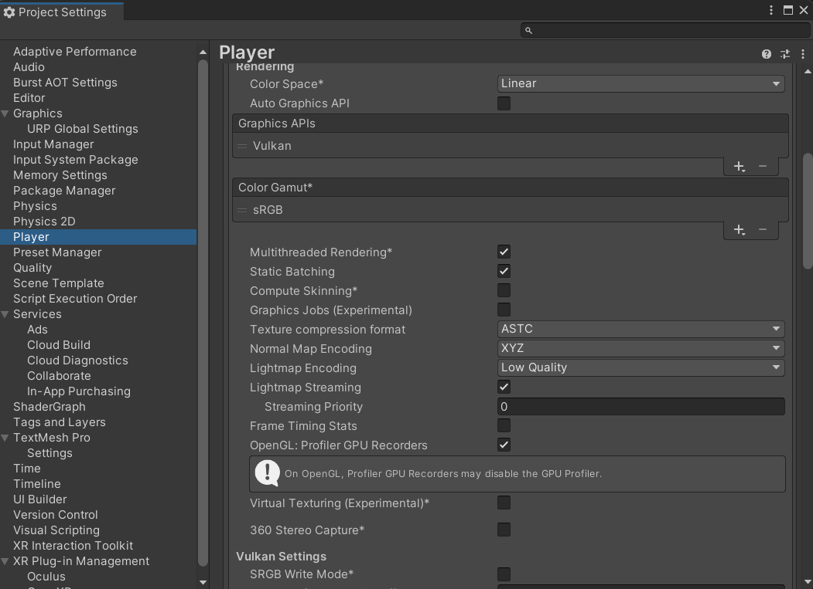

Player Implementation
For player VR controllers in your project, you utilized the XR Origin component which provides a ready camera and left/right controller. Additionally, you added a locomotion system and teleportation provider to enable movement within the VR environment. Finally, you added Oculus Hands to provide a sense of interaction and control within the VR space. These additions to the VR setup provide a more immersive experience for the player.

Here is the detailed explanation:

XR Origin Component:
The XR Origin component is a useful tool provided in Unity's XR Plugin architecture. It acts as the root transform for all XR components in a scene and provides a convenient starting point for adding VR functionalities to your game or app.

Locomotion System:
The locomotion system provides a means for the player to move around within the VR environment. This can include teleportation, joysticks, or other methods of movement. It's essential for providing the player with a sense of mobility and exploration.

Teleportation Provider:
The teleportation provider allows the player to teleport from one location to another within the VR environment. This is achieved by using VR controllers to point and select a location to teleport to.
     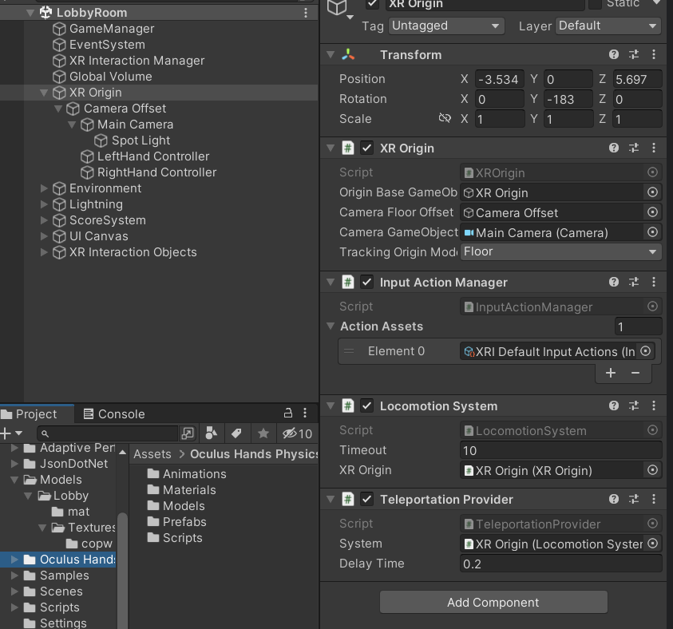

Oculus Hands:
Oculus Hands is a component provided by the Oculus XR Plugin. It enables the player to interact with the VR environment by allowing the player to see their hands and manipulate objects within the environment. It provides a sense of immersion and control within the VR space.
     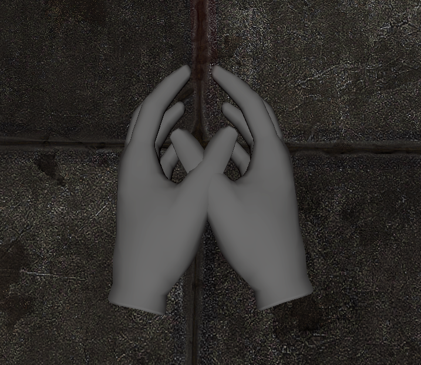

Environment
For the lighting, in the lobby environment, we have added dimly lit effects to set the mood for the scene. We used a combination of ambient lighting and spotlights to achieve the desired effect. The ambient lighting provides a soft fill light to the entire scene, while the spotlights add highlights to certain objects and areas, creating depth and interest.

To facilitate teleportation, we added teleportation anchor objects throughout the lobby environment. These anchor objects allow the player to teleport to specific locations within the room. We have placed these objects in strategic positions, making it easy for the player to navigate the space and get to where they need to go.
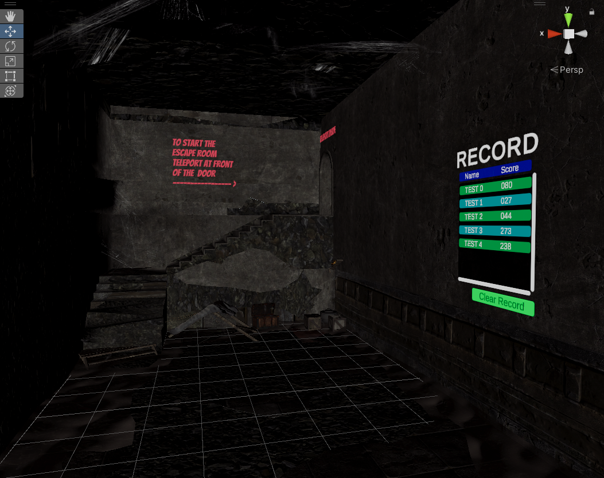
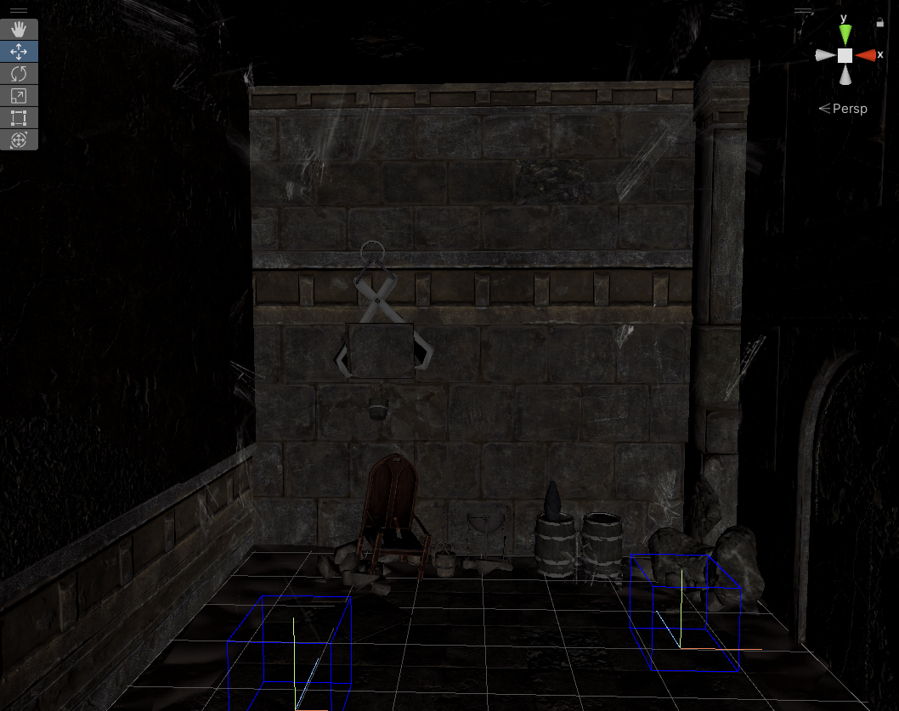
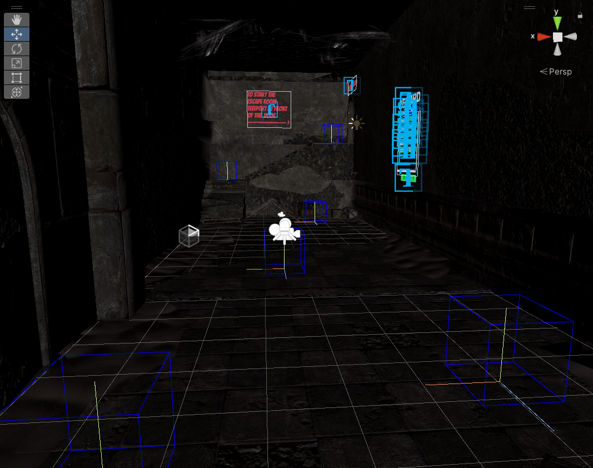
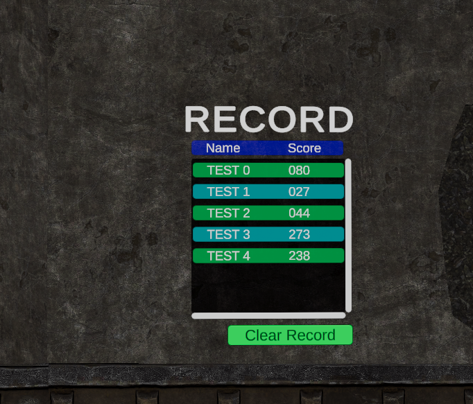
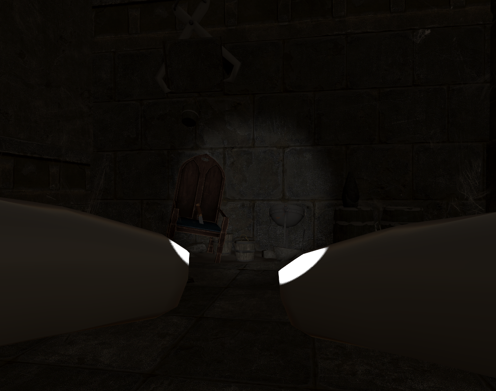
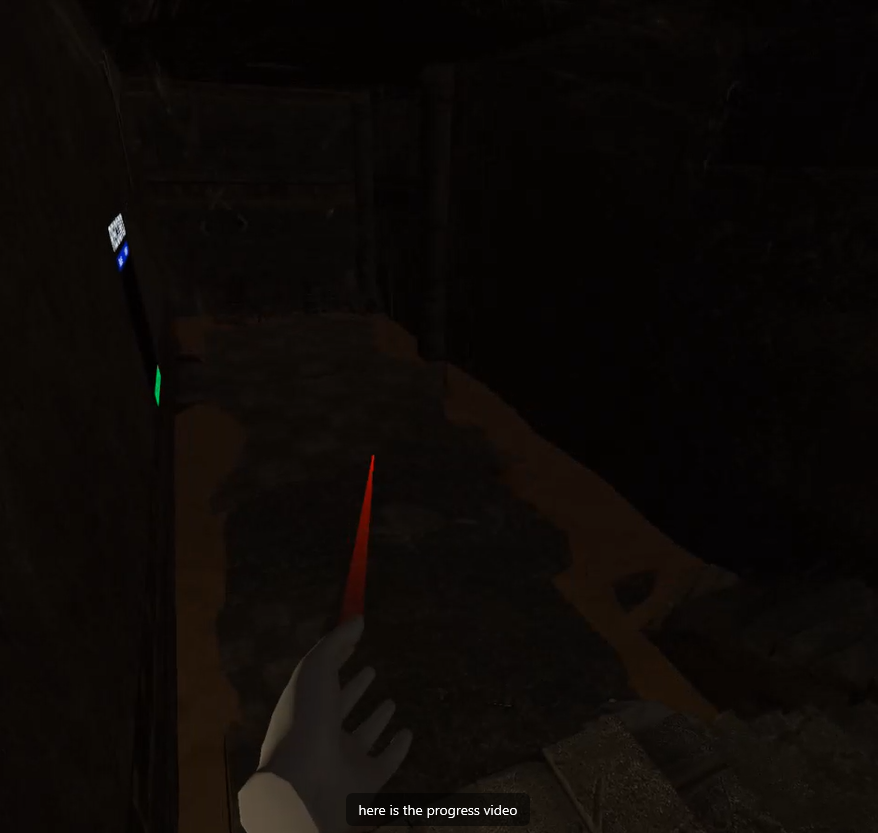